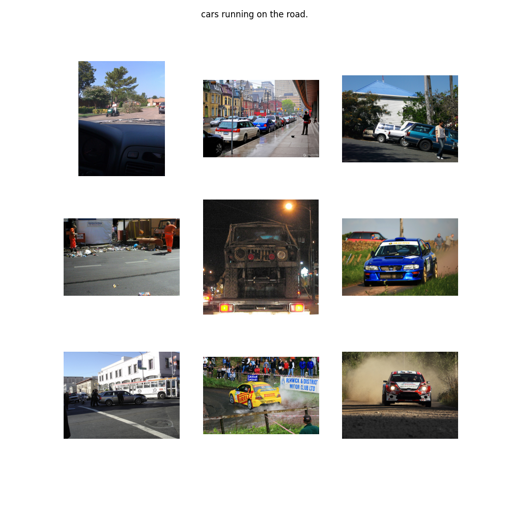

# Zero-shot Image Classification with CLIP from scratch

This repository provides a comprehensive implementation of a zero-shot image classification utilizing the CLIP (Contrastive Language-Image Pre-training) architecture. The model is trained on the Flickr30k dataset and is capable of performing image-text matching tasks effectively.


CLIP, developed by OpenAI in 2021, is a sophisticated vision-and-language model designed to bridge the gap between images and their textual descriptions.

## Requirements

To set up the environment, clone the repository and install the necessary packages:


```bash
conda create --name clip_training_env

conda activate clip_training_env

pip3 install ipykernel

python3 -m ipykernel install --user --name clip_training_env --display-name clip_training_env

pip3 install -r requirements.txt

```

## Data

This repository uses the Flickr30k dataset for training the model. To download the dataset, execute the following commands:

```bash
./download_flickr_dataset.sh
```

## Usage

To run the image classification script, use the following command:

```bash
python3 ./clip_classification.py
```

The script will save the trained model weights and visualize image-text pairs.

### Visualized Image



*Note: This is a demonstration. For higher accuracy, please customize the training strategy.*

## Model Architecture

The CLIP model architecture includes:

- Image Encoder 
- Text Encoder 
- Projection heads for both image and text embeddings

## Training

The training process involves:

1. Data preparation and splitting
2. Model initialization
3. Training loop with validation
4. Saving the best model checkpoint

## Evaluation

Post-training, the model performs zero-shot classification on a set of predefined queries.

## References

For further details, please refer to the official CLIP repository: [CLIP](https://github.com/openai/CLIP?tab=readme-ov-file)

---

This README provides a structured and professional overview of the repository, highlighting the key features, setup instructions, and customization options available for users.

